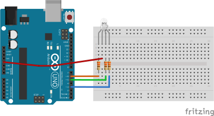
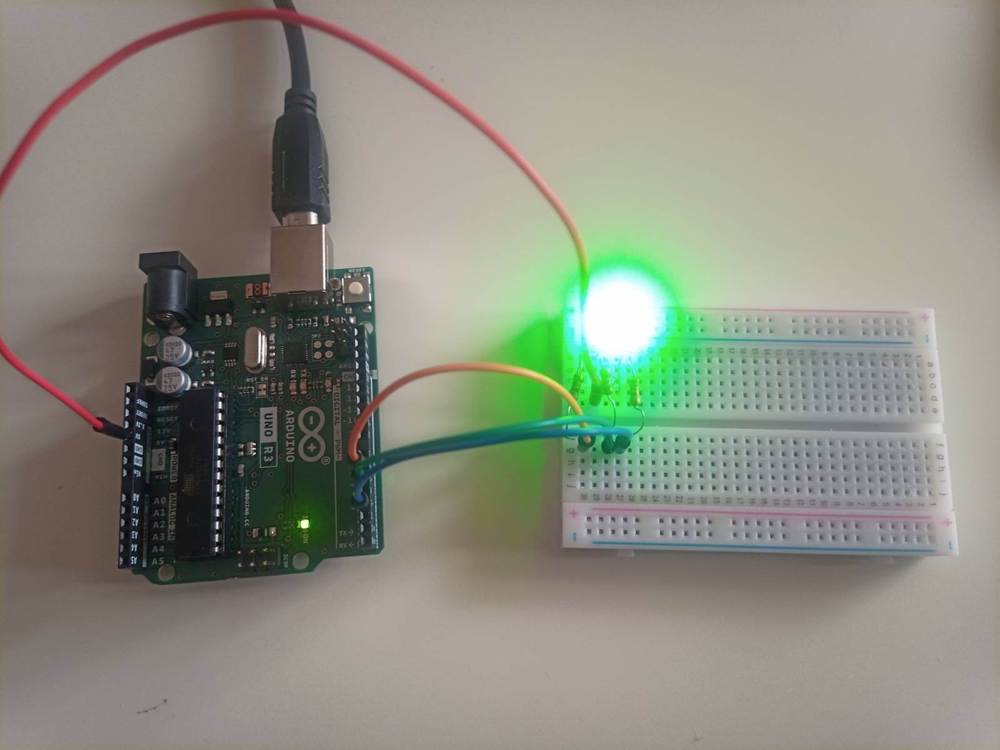

# Dioda RGB

W tym przykładzie podłączymy diodę RGB (wspólna anoda). Potrzebne będą następujące elementy:

- Arduino UNO
- Płytka stykowa
- Dioda RGB (wspólna anoda)
- 4 przewody połączeniowe
- 3 rezystory 330Ω

## Schemat



## Przykładowe podłączenie



## Przykładowy kod

```js
require('dotenv').config();
const Five = require('johnny-five');

const BOARD_PORT = process.env.BOARD_PORT;
const board = new Five.Board({
  port: BOARD_PORT,
});

function onReady() {
  const led = new Five.Led.RGB({
    pins: {
      red: 6,
      green: 5,
      blue: 3,
    },
    isAnode: true,
  });

  led.on();
  led.color('#0000ff');
}

board.on('ready', onReady);
```
