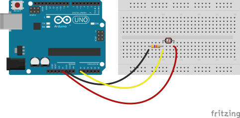
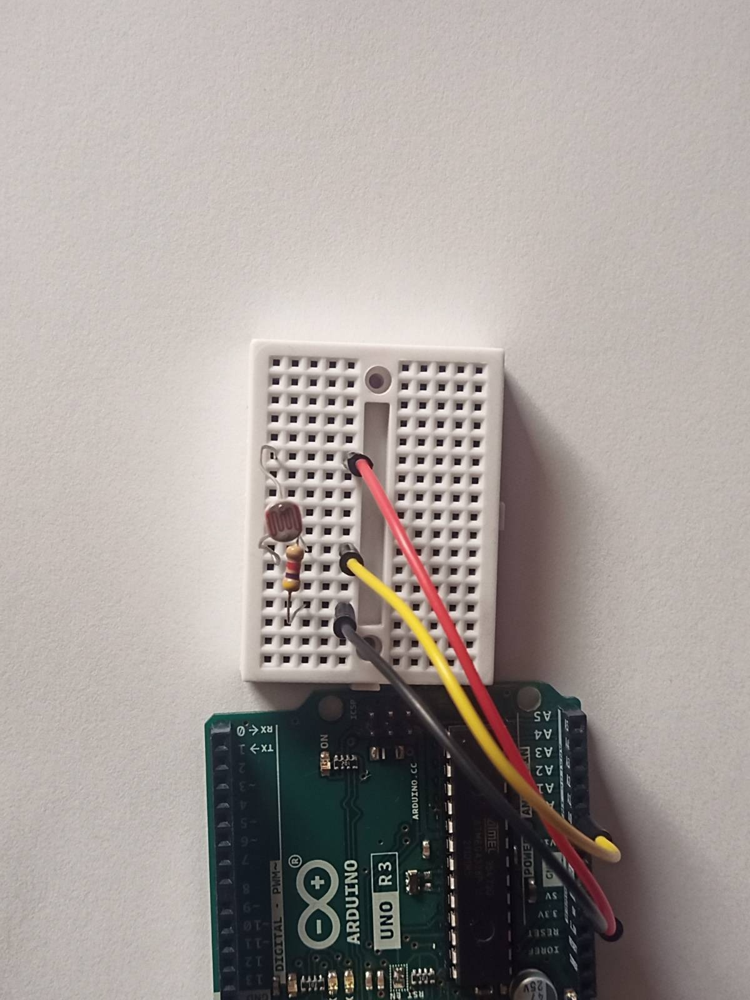

# Tryb jasny i ciemny przy pomocy fotorezystora

Potrzebujemy:

- Arduino UNO
- Płytka stykowa
- 3 przewody połączeniowe
- Rezystor 4,7kΩ
- Fotorezystor 5-10kΩ

## Schemat



## Przykładowe podłączenie



<!-- <video
  controls
  src="./img/002-photoresistor.webm"
  poster="./img/002-photoresistor-cover.jpg"
  width="620">

  <source src="./img/002-photoresistor.webm" type="video/webm" />
  <p>
    Download the
    <a href="./img/002-photoresistor.mp4">MP4</a>
    video.
  </p>
</video> -->

## Przykładowy kod

```js
require('dotenv').config();
const http = require('http');
const express = require('express');
const sio = require('socket.io');
const cors = require('cors');
const app = express();
const server = http.createServer(app);
let io;

app.use(express.static('public'));
app.use(cors());
const SERVER_PORT = process.env.SERVER_PORT;

io = sio(server);

app.get('/', (req, res) => {
  res.sendFile(__dirname + '/public/index.html');
});

server.listen(SERVER_PORT, () => {
  console.log(`Server is up and running at: http://localhost:${SERVER_PORT}`);
});

let board;
const Five = require('johnny-five');
const BOARD_PORT = process.env.BOARD_PORT;

board = new Five.Board({
  port: BOARD_PORT,
});

function onReady() {
  let lightLevel = 0;
  const sensor = new Five.Sensor({
    pin: 'A0',
    freq: 500,
  });

  sensor.on('change', () => {
    const scaledValue = sensor.scaleTo(0, 100);

    lightLevel = scaledValue;
    console.log('lightLevel:', lightLevel);
    io.sockets.emit('lightLevelChanged', {
      lightLevel,
    });
  });

  io.on('connection', function (socket) {
    console.log(`Client connected: ${socket.id}`);

    socket.on('disconnect', function (reason, socket) {
      console.log(`Client disconnected  with reason: ${reason}`);
    });
  });
}

board.on('ready', onReady);
```
