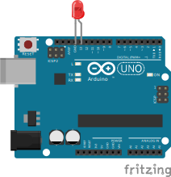
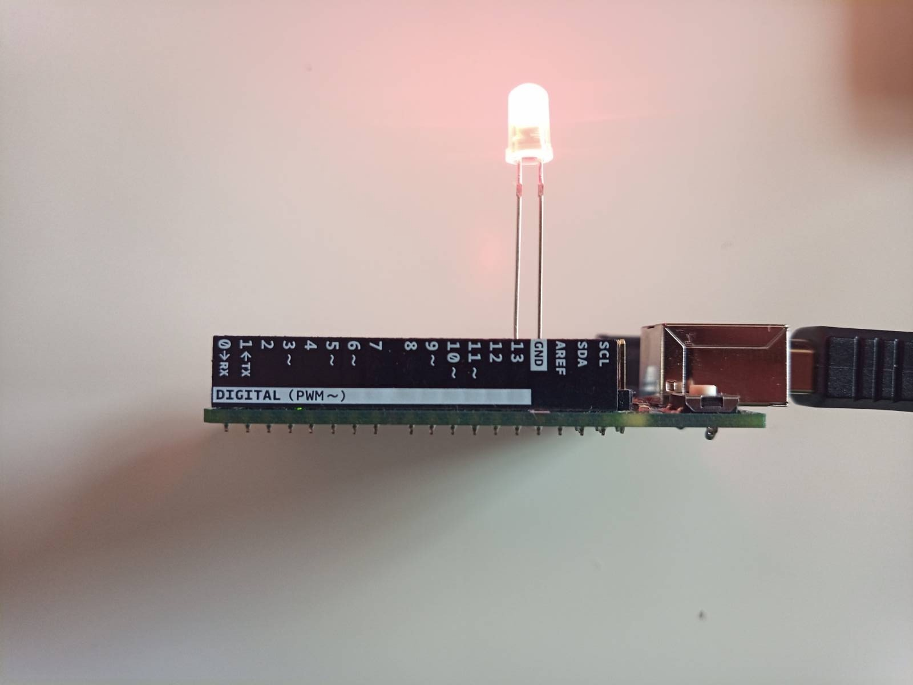

# Witaj, świecie

Na rozruch podłączmy diodę. Anodę (dłuższą nóżkę) podłącz do pinu nr 13, a katodę do uziemienia (_GND_).<br />Potrzebujemy:

- Arduino UNO
- Dioda (czerwona)

## Schemat



## Przykładowe podłączenie



## Przykładowy kod

Zwróć uwagę na metodę `this.repl.inject`. Po uruchomieniu skryptu obiekt `led` jest dostępny w konsoli; możesz przetestować [API](https://johnny-five.io/api/led/#api) w środowisku _REPL_.

```js
require('dotenv').config();
const Five = require('johnny-five');

const BOARD_PORT = process.env.BOARD_PORT;
const board = new Five.Board({
  port: BOARD_PORT,
});

function onReady() {
  const led = new Five.Led('13');

  led.blink(500);

  this.repl.inject({
    led: led,
  });
}

board.on('ready', onReady);
```
