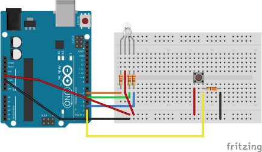
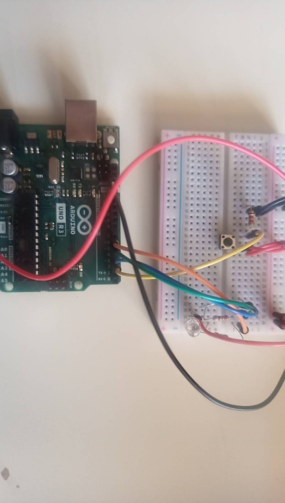

# Sterowanie diodą LED

Ten przykład to kontynuacja poprzedniego przykładu (Dioda RBG). Tym razem przy pomocy intefejsu webowego zmienim kolor diody. Komunikacja odbędzie się przez socket.io.
Dodatkowo umieszczony na płytce stykowej przycisk (Tact Switch) przełączy miganie diody w wybranym przez nas kolorze.

Potrzebujemy:

- Arduino UNO
- Płytka stykowa
- Dioda RGB (wspólna anoda)
- 4 przewody połączeniowe
- 3 rezystory 330Ω
- 1 rezystor 220Ω
- 1 przycisk (Tact Switch)

## Schemat



## Przykładowe podłączenie



## Przykładowy kod

```js
require('dotenv').config();
const http = require('http');
const express = require('express');
const sio = require('socket.io');
const cors = require('cors');
const app = express();
const server = http.createServer(app);
const port = 3000;
let io;

const corsOptions = {
  origin: ['http://localhost:4200', 'http://192.168.1.110:4200'],
};

app.options(
  '*',
  cors({
    options: corsOptions,
  })
);

app.use(express.static('public'));
app.use(cors());

io = sio(server, {
  cors: {
    origin: '*',
  },
});

app.get('/', (req, res) => {
  res.sendFile(__dirname + '/public/index.html');
});

server.listen(port, () => {
  console.log(`Server is up and running at: http://localhost:${port}`);
});

const Five = require('johnny-five');

const BOARD_PORT = process.env.BOARD_PORT;
const board = new Five.Board({
  port: BOARD_PORT,
});
let activeColor = '#ff0000';

function onReady() {
  const led = new Five.Led.RGB({
    pins: {
      red: 6,
      green: 5,
      blue: 3,
    },
    intensity: 10,
    isAnode: true,
  });
  const button = new Five.Button(2);
  let buttonPressed = false;

  led.on();
  led.color(activeColor);

  button.on('up', () => {
    buttonPressed = !buttonPressed;
    if (buttonPressed) {
      led.strobe();
    } else {
      led.stop().off().on().color(activeColor);
    }
  });

  io.on('connection', function (socket) {
    console.log(`Client connected: ${socket.id}`);

    socket.on('disconnect', function (reason, socket) {
      console.log(`Client disconnected ${socket.id} with reason: ${reason}`);
    });

    socket.on('color-changed', (color) => {
      activeColor = color;
      led.color(color);
    });
  });

  this.repl.inject({
    led: led,
    button: button,
  });
}

board.on('ready', onReady);
…
```
