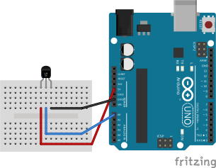
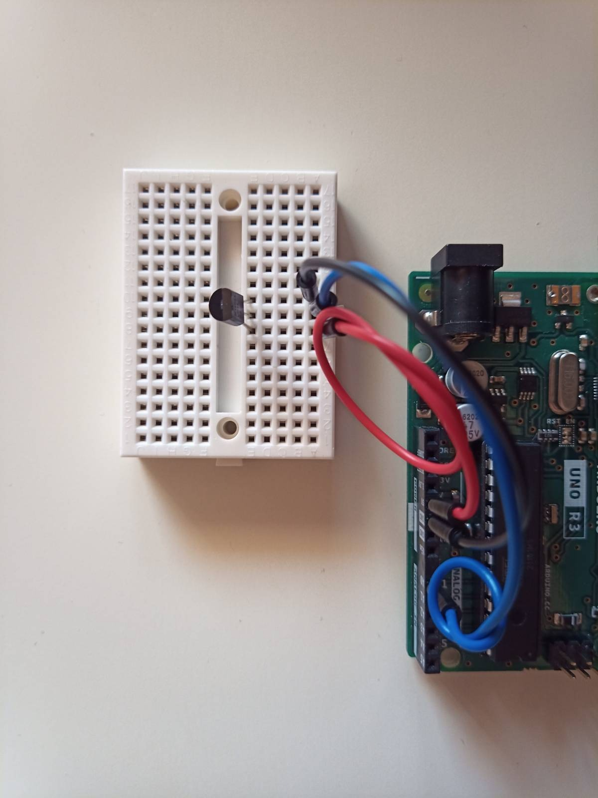
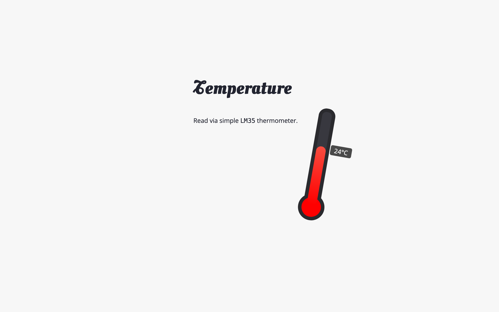

# Analogowy czujnik temperatury LM35DZ

Potrzebujemy:

- Arduino UNO
- Płytka stykowa
- 3 przewody połączeniowe
- Analogowy czujnik temperatura LM35DZ

## Schemat



## Przykładowe podłączenie




## Przykładowy kod

Część backendowa została pominięta.

```js
require('dotenv').config();
const http = require('http');
const express = require('express');
const sio = require('socket.io');
const cors = require('cors');
const app = express();
const server = http.createServer(app);
let io;

app.use(express.static('public'));
app.use(cors());
const SERVER_PORT = process.env.SERVER_PORT;

io = sio(server);

app.get('/', (req, res) => {
  res.sendFile(__dirname + '/public/index.html');
});

server.listen(SERVER_PORT, () => {
  console.log(`Server is up and running at: http://localhost:${SERVER_PORT}`);
});

const Five = require('johnny-five');

const BOARD_PORT = process.env.BOARD_PORT;
const board = new Five.Board({
  port: BOARD_PORT,
});

function onReady() {
  const thermometer = new Five.Thermometer({
    controller: 'LM35',
    pin: 'A0',
  });

  thermometer.on('change', ({ celsius }) => {
    console.log('Temperature');
    console.log('  celsius      : ', celsius);
    console.log('--------------------------------------');

    io.sockets.emit('temperatureChanged', {
      celsius,
    });
  });

  io.on('connection', function (socket) {
    console.log(`Client connected: ${socket.id}`);

    socket.on('disconnect', function (reason, socket) {
      console.log(`Client disconnected  with reason: ${reason}`);
    });
  });
}

board.on('ready', onReady);
```
